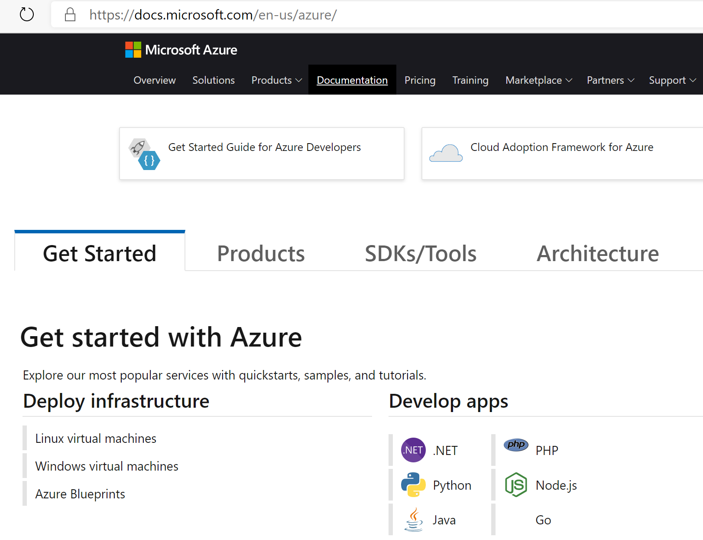

As I got asked so many times what Azure learning resources are available, I thought this could make up an excellent blog post :) - This is actually based on a summary slide I have added to my in-person and online Azure training workshops closing deck, but updated where needed. Below order is a random listing of resources, not forcing any priority or preference:

1. Microsoft Learn

2. Microsoft Hands-on Labs

3. Azure Docs

4. 3rd party learning resources 

Let me guide you through each and one of them:

## 1. Microsoft Learn 
(http://www.microsoft.com/learn) 

Microsoft Learn is "the" landing page for all learning resources Microsoft has to offer, not just Azure. Here, you find a listing of all current learning paths, pointers to hands-on lab exercises in a sand-boxed setup, an overview of Microsoft certifications and exams, and much more. It also points you to the official Microsoft Docs website (see below).

By selecting Browse all paths or Browse all learning options, you are redirected to the actual Learning Paths. A Learning Path is a collection of learning material, which can be documentation, a training video and/or an exercise. Most of the time, it is really a combination of all 3 flavors. This reflects to the different learning styles people have. Some learn better from reading (docs), some other like to hear and see (video), where other - including myself - mainly learn by doing (hands-on labs). 

Using the filters on the side, you can find the specific Azure material, or even drill down on specific Azure services or features you want to focus on. (About 30% of all learning path material is related to Azure...)

Next, you can choose from the full Learning Path, giving you several hours of content to go through, or pick stand-alone modules, typically shorter (30-90 mins) and more focused.

In this example, I filtered on Azure / Functions, which brings up a list of 2 Learning Paths and 15 Modules (at the time of writing, it might change over time :)). Let me select the Create Serverless Applications Learning Path; this opens a list of stand-alone content, again nicely structured per topic. Each topic is again a collection of shorter snippets. 

I hope this gets you going in your Azure-learning journey. But wait, there is more ;)

## 2. Microsoft Hands-on Labs 
(http://www.microsoft.com/handsonlabs/selfpacedlabs) 

Compared to the "watch or read" approach from the Microsoft Learn Learning Paths, the Microsoft Hands-on Labs offer you self-paced labs, focusing on a "learn by doing" concept.

Again, this source is not just offering Azure material, but covers most of the Microsoft product stack (Office 365, .NET development, Windows Server, Windows Client,...). 

If you filter again on Azure content, it currently shows 30 different labs, from beginners to advanced learner level.

The most interesting aspect - besides learning by doing of course - is you don't need an Azure subscription to perform the lab steps. While there is still a separate URL to get here, it actually redirects you back to the overall Microsoft Learn website. However, there is no easy way to retrieve the hands-on labs only (Microsoft, make this available as a learning type option please). So it requires some wondering around the website, browsing Learning Paths and Modules, to find any resource having "exercise" in the title. 

As an example, I selected the "Create a Windows Virtual Machine"; as you can see from below screenshot, it offers you to activate sandbox. This creates a temporary Azure subscription, dedicated to this specific lab scenario. One can activate 10 such sandbox environments per day, which should be more than enough for most learners. 

After giving consent using a Microsoft account (Outlook, Hotmail,...) (Office 365 doesn't seem to work here?), it will add a temporary subscription to your Microsoft account credentials, in a dedicated Microsoft Learn Sandbox Azure Tenant. 

From here, you can literally follow the instructions from the exercise description pages. Pretty sweet in my opinion!

## 3. Azure Docs 
(https://docs.microsoft.com/en-us/azure) 

No better resource to learn about Azure than the official Azure Documentation! While it is obviously not built as a learning to per sé, it actually does the job really well! Starting from a high-level overview of Azure services, one can easily drill down to the specific topic you want to learn about. For most services, this will list up a "tutorial" section. That's where you find most useful "how-to" documentation and guides. If that's what you are looking for. 

Using a similar example as before, I made the following selections:

- Get started with Azure / Deploy Infrastructure

- Windows Virtual Machines

(Notice the link to the previously discussed self-paced training also shows up here)

Which brings me to the actual Azure doc pages, describing how to create an Windows Virtual Machine in Azure. From here, I can scroll down to the specific deployment approach I want to learn, being PowerShell, Azure CLI or using the Portal. 

 Besides reading through the different steps, you can also try them out live, assuming you have an Azure Free or Paid subscription already (in contrast to the sandbox scenario described earlier).

# 4. Third party learning resources

Aside from the above 3 Microsoft-owned resources, there is a huge amount of (free and paid) Azure learning material available on the internet. My recommendation is to try and filter on content which is less than 6 months old, as otherwise it might probably be too outdated (depending a bit on the Azure service).

Without trying to be complete, below is a list of learning partners offering some very good and up-to-date content on Azure. I have authored several videos for the first 3 listed here, but don't exclusively check those. Several also provide a multi-day trial subscription, which could be just enough to learn about that one specific Azure service.

- [Opsgility](http://www.opsgility.com/)

- [Packt](http://www.packtpub.com/) 

- [Apress](http://www.apress.com/)

- [Pluralsight](http://www.pluralsight.com/)

- [A Cloud Guru](http://www.acloudguru.com/)

- [Udemy](http://www.udemy.com/)

- [Youtube](http://www.youtube.com)

I hope this article gives you enough insights on different Microsoft and 3rd party Azure learning resources available today. 

Don't hesitate reaching out if you have any questions on the discussed content.

/Peter 
