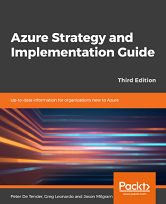

You might get amazed, finding out I managed to publish yet another book, where the previous one **[Efficiently Migrating your workloads to Azure](https://leanpub.com/efficientlymigratingworkloadstoazure)** only got published around Christmas. 

However, this new one was a "longer work in progress", and not something I could spew out in just a few weeks.

Several months ago, I got approached by Packt Publishing, asking me to "write a quick note on how I look at Azure strategic implementation and migration". Which was initially sized at max. 20 pages. However, it became clear, this quick writing gig would end up becoming a lot larger, and eventually involve multiple authors, to cover the full Azure platform spectrum. 

As the core question they started from is my core playground, it honestly didn't take me that long to write down my vision. However, after I sent in my first draft, that's where the real work came in (as well as the decision to make this a larger project). Based on the fast pace of Azure services and overall updates coming out, I wanted to make sure they were captured in the book as well. As - after all - , this guide was written towards technical decision makers, IT managers, cloud architects,... helping them in making a strategic decision to start moving workloads to Azure. So it better was complete...

Jumping a few months further in 2019, and literally having lost tracks on the amount of updates I worked on, also based on the tremendous input from technical reviewer , MCT, MVP and overall cloud enthusiast and solution architect Steve Buchanan (@bucatech), I'm honored and proud to see this work published on the Microsoft website: 

 https://azure.microsoft.com/en-us/resources/azure-strategy-and-implementation-guide-third-edition/ 

summarized as follows:

Get a step by step introduction to using Azure for your cloud infrastructure with this Packt e-book. Read the latest edition of the Azure Strategy and Implementation Guide for detailed information on how to start taking advantage of Azure cloud capabilities. 
Download this e-book to: 
* Get an overview of Azure benefits and best practices for planning your migration. 
* Make cloud architecture and design choices that best fit your organization. 
* Learn how to manage and optimize your new cloud environment.  

As always, I hope this book maps with your interests and helps in your journey to Azure. Do not hesitate reaching out or sharing your feedback,

/Peter
